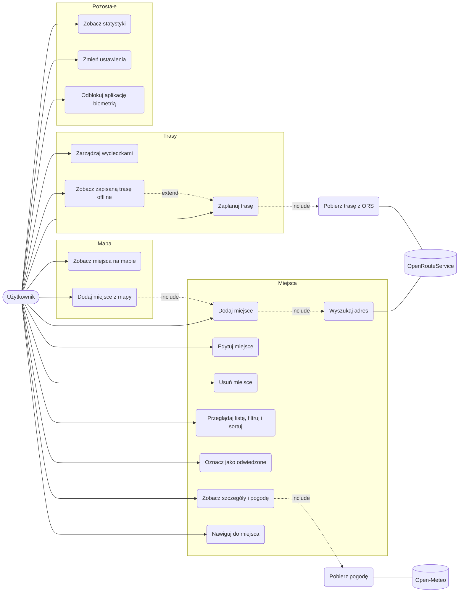

# Przypadki użycia

```mermaid
flowchart LR
    U([Użytkownik])

    subgraph Miejsca
        UC1(Dodaj miejsce)
        UC2(Edytuj miejsce)
        UC3(Usuń miejsce)
        UC4(Wyszukaj adres)
        UC5(Przeglądaj listę, filtruj i sortuj)
        UC6(Oznacz jako odwiedzone)
        UC7(Zobacz szczegóły i pogodę)
        UC8(Nawiguj do miejsca)
    end

    subgraph Mapa
        UC9(Zobacz miejsca na mapie)
        UC10(Dodaj miejsce z mapy)
    end

    subgraph Trasy
        UC11(Zarządzaj wycieczkami)
        UC12(Zaplanuj trasę)
        UC13(Zobacz zapisaną trasę offline)
    end

    subgraph Pozostałe
        UC14(Zobacz statystyki)
        UC15(Zmień ustawienia)
        UC16(Odblokuj aplikację biometrią)
    end

    U --> UC1 & UC2 & UC3 & UC5 & UC6 & UC7 & UC8
    U --> UC9 & UC10
    U --> UC11 & UC12 & UC13
    U --> UC14 & UC15 & UC16

    UC1 -. include .-> UC4
    UC10 -. include .-> UC1
    UC7 -. include .-> UC17(Pobierz pogodę)
    UC12 -. include .-> UC18(Pobierz trasę z ORS)
    UC13 -. extend .-> UC12

    UC4 --- ORS[(OpenRouteService)]
    UC18 --- ORS
    UC17 --- OM[(Open-Meteo)]
```
